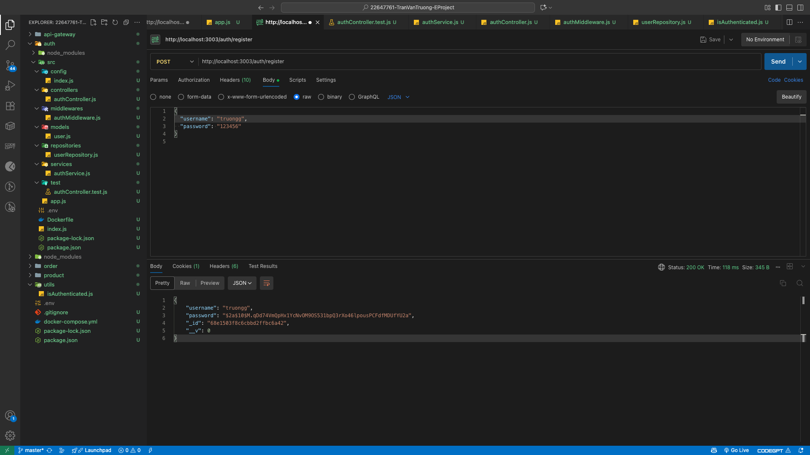
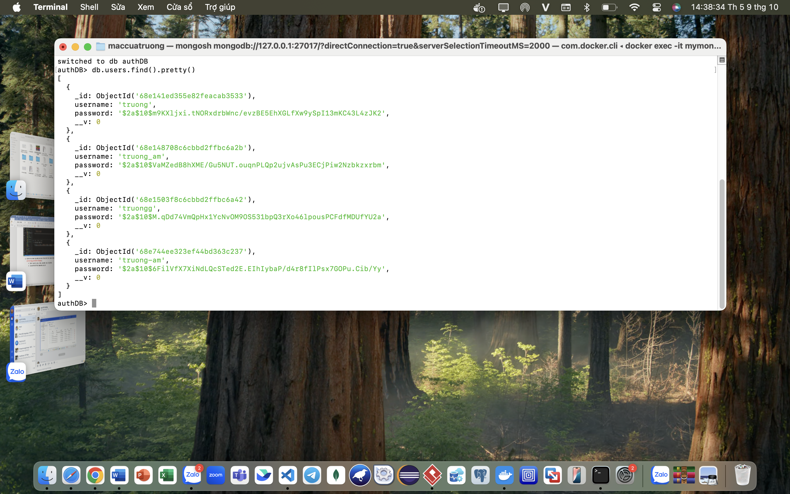
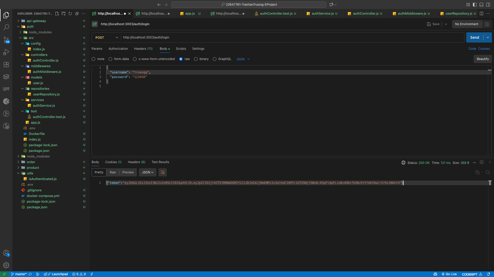
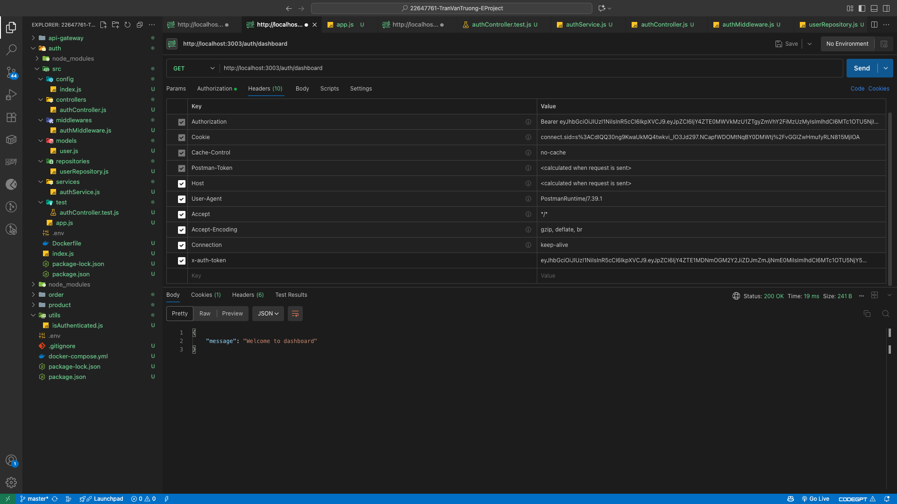
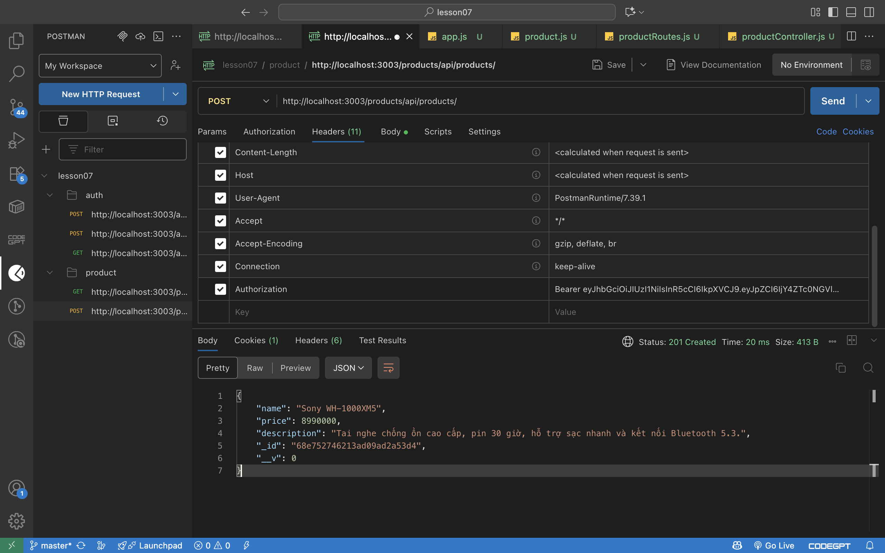
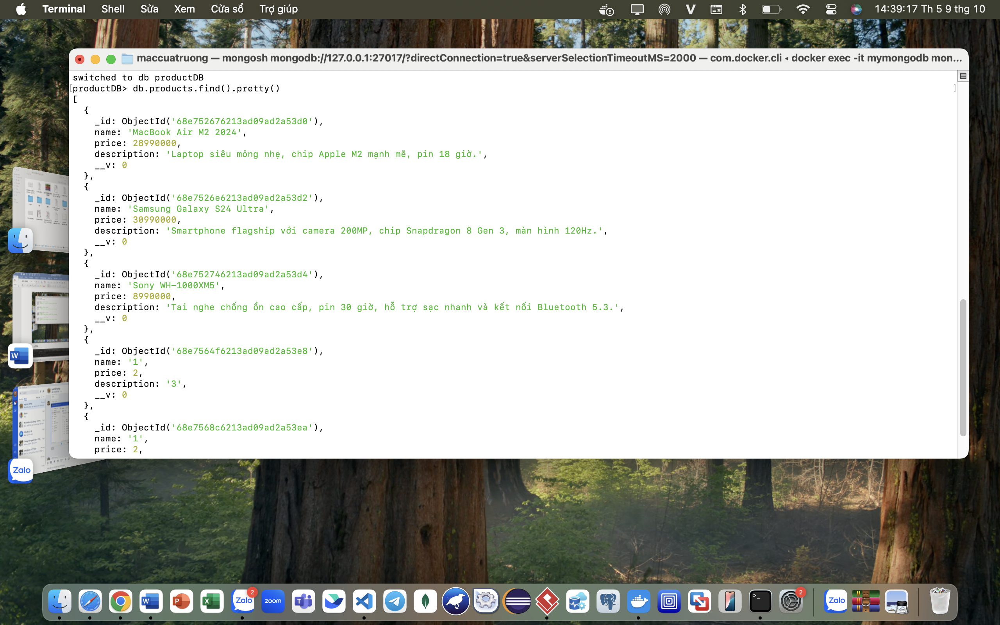
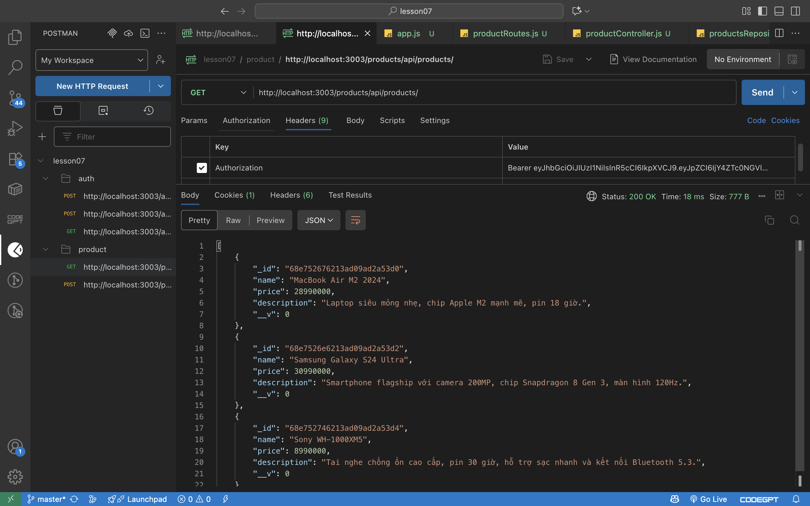
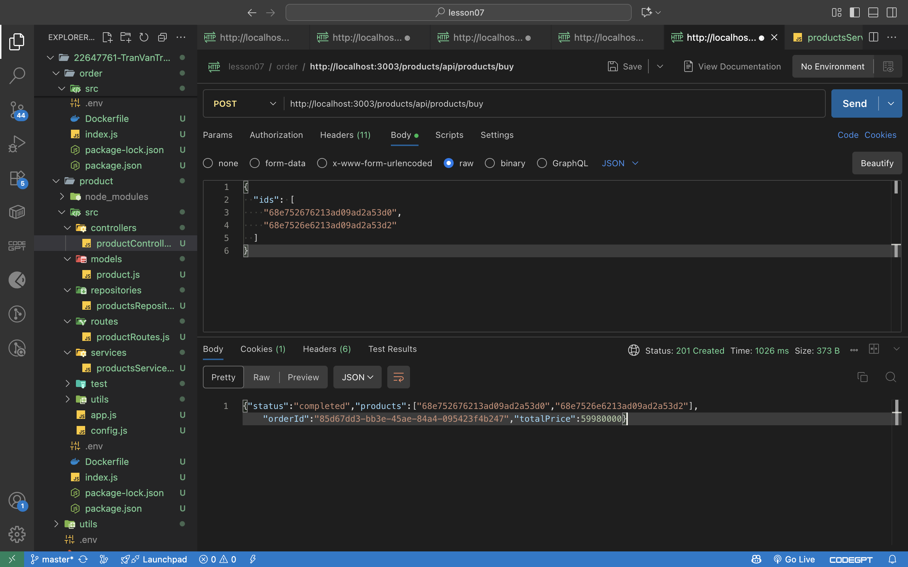
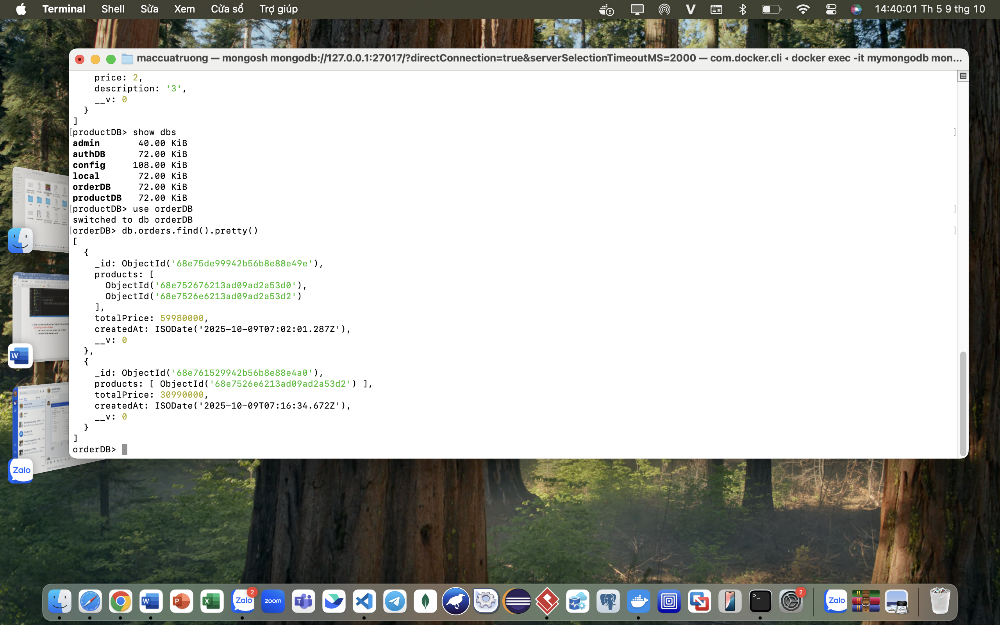

🧩 E-Commerce Microservices System
🧠 Giới thiệu dự án
Dự án được xây dựng theo mô hình Microservices Architecture, mô phỏng một hệ thống thương mại điện tử đơn giản, trong đó mỗi chức năng được tách thành một service độc lập.
Các service giao tiếp với nhau thông qua API Gateway và có thể mở rộng dễ dàng bằng Docker.
🏗️ Cấu trúc hệ thống
├── api-gateway/       → Cổng giao tiếp trung gian giữa client và các service
│   ├── Dockerfile
│   ├── index.js
│   └── package.json
│
├── auth/              → Xử lý xác thực người dùng (đăng ký, đăng nhập)
│   ├── src/
│   ├── .env
│   ├── Dockerfile
│   ├── index.js
│   └── package.json
│
├── product/           → Quản lý sản phẩm (thêm, lấy danh sách sản phẩm)
│   ├── src/
│   ├── .env
│   ├── Dockerfile
│   ├── index.js
│   └── package.json
│
├── order/             → Quản lý đơn hàng (tạo và lưu thông tin đơn hàng)
    ├── src/
    ├── .env
    ├── Dockerfile
    ├── index.js
    └── package.json

⚙️ Công nghệ sử dụng
Node.js và Express.js cho từng microservice
Docker để container hóa từng service
RabbitMQ để giao tiếp giữa các service (message broker)
MongoDB để lưu dữ liệu người dùng, sản phẩm và đơn hàng
Postman để test các API
🚀 Quy trình khởi chạy
 Cài đặt source code
git clone [<repository-url>](https://github.com/vanTruong179/22647761-TranVanTruong-EProject.git)
cd 22647761-TranVanTruong-EProject
 Chạy project
docker compose up --build

> -REGISTER
>
> {width="6.5in" height="3.65625in"}
>
> {width="6.5in" height="4.0625in"}

-LOGIN

{width="6.5in" height="3.65625in"}

-DASHBOARD

{width="6.5in" height="3.65625in"}

-ADD PRODUCT

{width="6.5in" height="4.0625in"}

{width="6.5in" height="4.0625in"}

-GET PRODUCTS

{width="6.5in" height="4.0625in"}

-CREATE ORDER

{width="6.5in" height="4.0625in"}

{width="6.5in" height="4.0625in"}

5.  Commit to onwer repository named: StudentID-Fullname-EProject
    (example: *2231213-NguyenVanAn-EProject*).

    - Don't commit: .env, node_modules and .DS_Store

    - Create README to describe project
